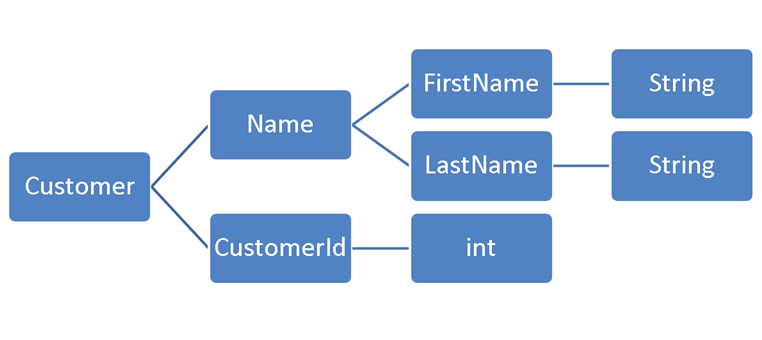

# Object Calisthenics

Are programming exercises, formalized as a set of 9 rules invented by **Jeff Bay** in his book **The ThoughtWorks Anthology**. The word Object is related to Object Oriented Programming. The word Calisthenics is derived from greek, and means exercises under the context of gymnastics. By trying to follow these rules as much as possible, you will naturally change how you write code. It doesn’t mean you have to follow all these rules, all the time. Find your balance with these rules, use some of them only if you feel comfortable with them.

These rules focus on **maintainability, readability, testability, and comprehensibility** of your code. If you already write code that is maintainable, readable, testable, and comprehensible, then these rules will help you write code that is more maintainable, more readable, more testable, and more comprehensible.


In the following, I will review each of these 9 rules listed below:
><sup>Just try to apply some rules in your time, don't take this as religion.</sup>

- [1. Only One Level Of Indentation Per Method](#1-only-one-level-of-indentation-per-method)
- [2. Don’t Use The ELSE Keyword](#2-dont-use-the-else-keyword)
- [3. Wrap All Primitives And Strings](#3-wrap-all-primitives-and-strings)
- [4. First Class Collections](#4-first-class-collections)
- [5. One Dot Per Line](#5-one-dot-per-line)
- [6. Don’t Abbreviate](#6-dont-abbreviate)
- [7. Keep All Entities Small](#7-keep-all-entities-small)
- [8. No Classes With More Than Two Instance Variables](#8-no-classes-with-more-than-two-instance-variables)
- [9. No Getters/Setters/Properties](#9-no-getterssettersproperties)


## 1. Only One Level Of Indentation Per Method

Having too many levels of indentation in your code is often bad for readability, and maintainability. Most of the time, you can’t easily understand the code without compiling it in your head, especially if you have various conditions at different level, or a loop in another loop, as shown in this example:

```java
class Board {
    public String board() {
        StringBuilder buf = new StringBuilder();

        // 0
        for (int i = 0; i < 10; i++) {
            // 1
            for (int j = 0; j < 10; j++) {
                // 2
                buf.append(data[i][j]);
            }
            buf.append("\n");
        }

        return buf.toString();
    }
}
```

In order to follow this rule, you have to split your methods up. Martin Fowler, in his book Refactoring, introduces the Extract Method pattern, which is exactly what you have to do/use.

You won’t reduce the number of lines of code, but you will increase readability in a significant way:


```java
class Board {
    public String board() {
        StringBuilder buf = new StringBuilder();

        collectRows(buf);

        return buf.toString();
    }

    private void collectRows(StringBuilder buf) {
        for (int i = 0; i < 10; i++) {
            collectRow(buf, i);
        }
    }

    private void collectRow(StringBuilder buf, int row) {
        for (int i = 0; i < 10; i++) {
            buf.append(data[row][i]);
        }

        buf.append("\n");
    }
}
```

## 2. Don’t Use The ELSE Keyword

The `else` keyword is well-known as the `if/else` construct is built into nearly all programming languages. Do you remember the last time you saw a nested conditional? Did you enjoy reading it? I don’t think so, and that is exactly why it should be avoided. As it is so easy to add a new branch to the existing code than refactoring it to a better solution, you often end up with a really bad code.

```java
public void login(String username, String password) {
    if (userRepository.isValid(username, password)) {
        redirect("homepage");
    } else {
        addFlash("error", "Bad credentials");

        redirect("login");
    }
}
```

An easy way to remove the else keyword is to rely on the early return solution.

```java
public void login(String username, String password) {
    if (userRepository.isValid(username, password)) {
        return redirect("homepage");
    }

    addFlash("error", "Bad credentials");

    return redirect("login");
}
```

## 3. Wrap All Primitives And Strings

Following this rule is pretty easy, you simply have to encapsulate all the primitives within objects, in order to avoid the **Primitive Obsession anti-pattern**.

If the variable of your primitive type has a behavior, you MUST encapsulate it. And this is especially true for **Domain Driven Design**. DDD describes **Value Objects** like Money, or Hour for instance.

# 4. First Class Collections

Any class that contains a collection should contain no other member variables. If you have a set of elements and want to manipulate them, create a class that is dedicated for this set.

Each collection gets wrapped in its own class, so now behaviors related to the collection have a home (e.g. filter methods, applying a rule to each element).

# 5. One Dot Per Line

This dot is the one you use to call methods in Java, or C# for instance. It would be an arrow in PHP, but who uses PHP anyway? :D

Basically, the rule says that you should not chain method calls. However, it doesn’t apply to Fluent Interfaces and more generally to anything implementing the Method Chaining Pattern (e.g. a Query Builder).

For other classes, you should respect this rule. It is the direct use of the Law of Demeter, saying only talk to your immediate friends, and don’t talk to strangers.

Look at these classes:

```java
class Location {
    public Piece current;
}

class Piece {
    public String representation;
}

class Board {
    public String boardRepresentation() {
        StringBuilder buf = new StringBuilder();

        for (Location loc : squares()) {
            buf.append(loc.current.representation.substring(0, 1));
        }

        return buf.toString();
    }
}
```

It is ok-ish to have public attributes in `Piece` and `Location`. Actually, having a public property or a private one with `getter/setter` is the same thing (see **Rule 9**).

However, the `boardRepresentation()` method is awful, take a look at this line:

```java
buf.append(loc.current.representation.substring(0, 1));
```

It accesses a `Location`, then its current Piece, then the Piece’s representation on which it performs an action. This is far from One Dot Per Line.

Fortunately, the **Law of Demeter** tells you to talk to your friends, so let’s do that:

```java
class Location {
    private Piece current;

    public void addTo(StringBuilder buf) {
        current.addTo(buf);
    }
}
```

Making the instance of Piece private ensures that you won’t try to do something bad. However, as you need to perform an action on this attribute, you need a new method `addTo()`. It is not Location’s responsibility to determine how the Piece will be added, so let’s ask it:

```java
class Piece {
    private String representation;

    public String character() {
        return representation.substring(0, 1);
    }

    public void addTo(StringBuilder buf) {
        buf.append(character());
    }
}
```

Then again, you should change the visibility of your attribute. As a reminder, the **Open/Closed Principle says that software entities (classes, modules, functions, etc.) should be open for extension, but closed for modification**.

Also, extracting the code to get the first character of the representation in a new method looks like a good idea as it may be reused at some point. Finally, here is the updated Board class:

```java
class Board {
    public String boardRepresentation() {
        StringBuilder buf = new StringBuilder();

        for (Location location : squares()) {
            location.addTo(buf);
        }

        return buf.toString();
    }
}
```

## 6. Don’t Abbreviate

The right question is Why Do You Want To Abbreviate?

You may answer that it is because you write the same name over and over again? And I would answer that this method is reused multiple times, and that it looks like code duplication.

So you will say that the method name is too long anyway. And I would tell you that maybe your class has multiple responsibilities, which is bad as it violates the Single Responsibility Principle.

I often say that if you can’t find a decent name for a class or a method, something is probably wrong. It is a rule I use to follow while designing a software by naming things.

Don’t abbreviate, period.

## 7. Keep All Entities Small

No class over 50 lines and no package over 10 files. Well, it depends on you, but I think you could change the number of lines from 50 to 150.

The idea behind this rule is that long files are harder to read, harder to understand, and harder to maintain.

## 8. No Classes With More Than Two Instance Variables

I thought people would yell at me while introducing this rule, but it didn’t happen. This rule is probably the hardest one, but it promotes high cohesion, and better encapsulation.

A picture is worth a thousand words, so here is the explanation of this rule in picture. Note that it relies on **Rule 3: Wrap All Primitives And Strings**.



The main question was Why two attributes? My answer was Why not? Not the best explanation but, in my opinion, the main idea is to distinguish two kinds of classes, those that maintain the state of a single instance variable, and those that coordinate two separate variables. Two is an arbitrary choice that forces you to decouple your classes a lot.

## 9. No Getters/Setters/Properties

It is okay to use accessors to get the state of an object, **as long as you don’t use the result to make decisions outside the object. Any decisions based entirely upon the state of one object should be made inside the object itself**.

That is why `getters/setters` are often considered evil. Then again, they violate the Open/Closed Principle.

Let’s take an example:

```java
// Game
private int score;

public void setScore(int score) {
    this.score = score;
}

public int getScore() {
    return score;
}

// Usage
game.setScore(game.getScore() + ENEMY_DESTROYED_SCORE);
```

In the code above, the `getScore()` is used to make a decision, you choose how to increase your score, instead of leaving this responsibility to the `Game` instance.

A better solution would be to remove the getters/setters, and to provide methods that make sense. Remember, you must tell the class to do something, and you should not ask it. In the following, you tell the `game` to update your score as you destroyed `ENEMY_DESTROYED_SCORE` enemies.

```java
// Game
public void addScore(int delta) {
    score += delta;
}

// Usage
game.addScore(ENEMY_DESTROYED_SCORE);
```

It is game’s responsibility to determine how to update the score.

In this case, you could keep the `getScore()` as you may want to display it somewhere on the UI, but keep in mind that `setters` should not be allowed.

---

Credits: https://williamdurand.fr/2013/06/03/object-calisthenics/
