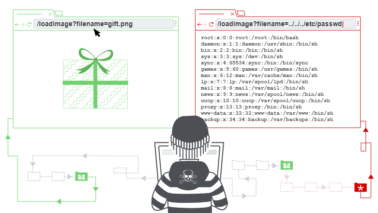

# Path Traversal Vulnerability

Also known as **Directory Traversal or Path Manipulation**, is a security vulnerability that allows an attacker to access files or directories that are located outside the web root directory. This vulnerability typically occurs when a web application accepts user input to specify a file path without properly sanitizing or validating the input.



How to identify if you are vulnerable:

- Be sure you understand how the underlying operating system will process filenames handed off to it.
- Don’t store sensitive configuration files inside the web root
- For Windows IIS servers, the web root should not be on the system disk, to prevent recursive traversal back to system directories.

Here's an example of a Path Traversal Vulnerability in a Node.js application:

```js
const http = require('http');
const fs = require('fs');
const path = require('path');

const server = http.createServer((req, res) => {
  let filePath = path.join(__dirname, req.url);

  fs.readFile(filePath, (err, data) => {
    if (err) {
      res.writeHead(404);
      res.end('File not found!');
    } else {
      res.writeHead(200);
      res.end(data);
    }
  });
});

server.listen(3000, () => {
  console.log('Server is running on port 3000');
});
```

in this example, the server simply reads files based on the URL path requested by the client. However, this code is vulnerable to path traversal attacks because it directly uses the URL path without proper validation.

To detect and avoid Path Traversal Vulnerabilities in Node.js, you can implement the following measures:

- Input Validation: Validate user input to ensure that it only contains allowed characters and does not include any directory traversal sequences (like "../").
- Canonicalization: Convert user-supplied paths into absolute paths and then check if they are within the expected directory structure.
- Use Libraries: Utilize libraries that handle file operations securely, such as path.resolve() or path.join() in Node.js, which help in constructing safe file paths.
- Prefer working without user input when using file system calls.
- Use indexes rather than actual portions of file names when templating or using language files (ie value 5 from the user submission = Czechoslovakian, rather than expecting the user to return “Czechoslovakian”).
- Ensure the user cannot supply all parts of the path – surround it with your path code.
- Validate the user’s input by only accepting known good – do not sanitize the data.
- Use chrooted jails and code access policies to restrict where the files can be obtained or saved to.

Here's a modified version of the previous code with input validation and canonicalization:

```js
const http = require('http');
const fs = require('fs');
const path = require('path');

const server = http.createServer((req, res) => {
  let requestedPath = req.url;

  if (!requestedPath || requestedPath.includes('..')) {
    res.writeHead(400);
    res.end('Bad Request');
    return;
  }

  let filePath = path.join(__dirname, requestedPath);

  if (!filePath.startsWith(__dirname)) {
    res.writeHead(403);
    res.end('Forbidden');
    return;
  }

  fs.readFile(filePath, (err, data) => {
    if (err) {
      res.writeHead(404);
      res.end('File not found!');
    } else {
      res.writeHead(200);
      res.end(data);
    }
  });
});

server.listen(3000, () => {
  console.log('Server is running on port 3000');
});
```

In this improved version, we validate the requested path and ensure that it doesn't contain any directory traversal sequences. Additionally, we check if the resolved file path is within the expected directory structure to prevent access to files outside the intended scope. These measures help mitigate the risk of Path Traversal Vulnerabilities in Node.js applications.
